# Use Case Workflows

This document visualizes the main workflows implemented by the DeFi term-deposit system. It is based on the current contracts, deployment scripts, frontend flows, and project documentation.

## System Overview

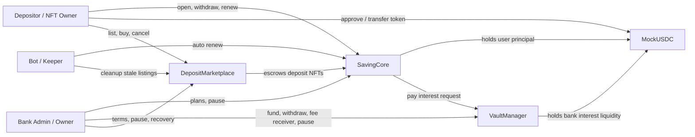

Core fund separation rule:

- `SavingCore` holds user principal and deposit NFT state.
- `VaultManager` holds bank-funded interest liquidity.
- `MockUSDC` is a 6-decimal ERC20 token used for tests and demo flows.
- `DepositMarketplace` escrows authentic `SavingCore` deposit NFTs during sale listings.

## Deployment Workflow

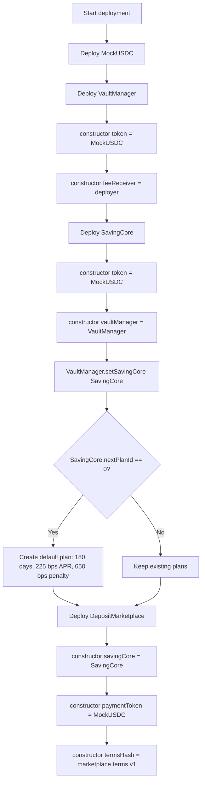

Relevant files:

- `deploy/01-deploy-mock-usdc.ts`
- `deploy/02-deploy-vault-manager.ts`
- `deploy/03-deploy-saving-core.ts`
- `deploy/04-deploy-deposit-marketplace.ts`

## Admin Plan Management

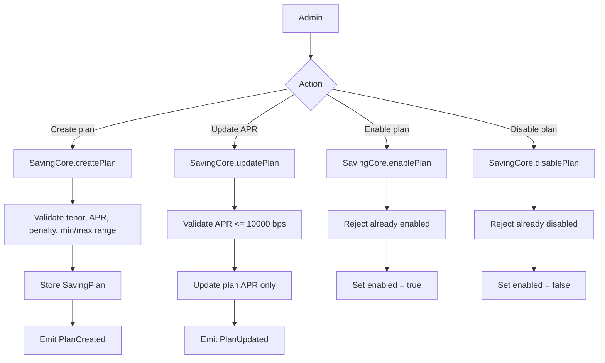

Important behavior:

- Plan updates affect future deposits only.
- Existing deposits keep their `aprBpsAtOpen` and `penaltyBpsAtOpen` snapshots.
- A disabled plan blocks new deposits, manual renewal into that plan, and auto-renewal of deposits from that original plan.
- Existing active deposits from a disabled plan can still be withdrawn normally.

## Admin Vault Management

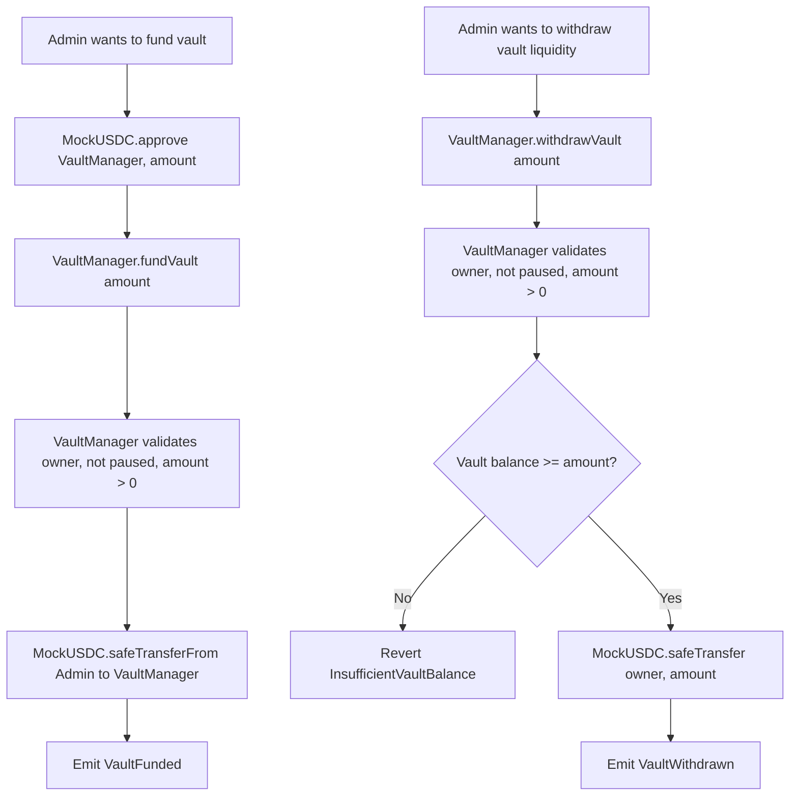

Vault admin controls:

- `fundVault(amount)` requires ERC20 approval for `VaultManager` first.
- `withdrawVault(amount)` transfers bank vault liquidity back to the owner.
- `setFeeReceiver(address)` updates where early-withdrawal penalties go.
- `setSavingCore(address)` configures the only contract allowed to call `payInterest`.
- `pause()` and `unpause()` stop or resume vault funding, withdrawals, and interest payments.

## Open Deposit

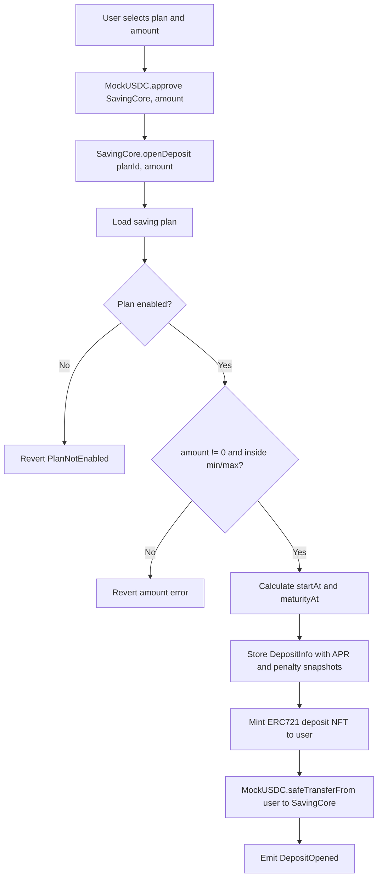

Result:

- Principal is held by `SavingCore`.
- User receives a deposit NFT.
- The NFT owner controls future withdrawal, renewal, transfer, or marketplace sale rights.
- `minDeposit = 0` means no lower limit, and `maxDeposit = 0` means no upper limit.

## Withdraw At Maturity

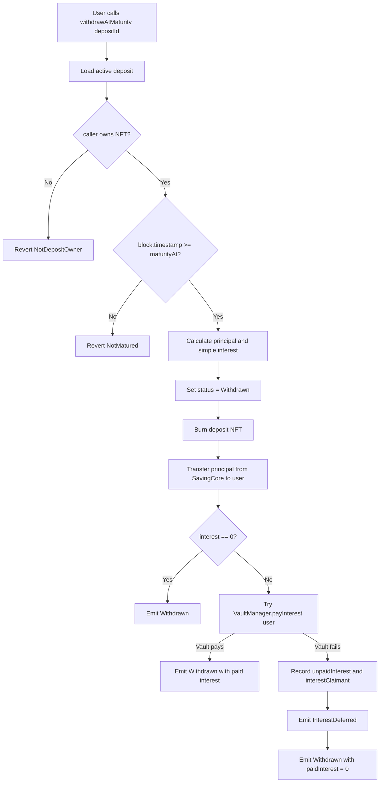

Interest formula:

```text
interest = principal * aprBpsAtOpen * tenorSeconds / (365 days * 10_000)
```

Principal-safe behavior:

- Principal is returned from `SavingCore` even if the vault cannot pay interest.
- If interest cannot be paid, the unpaid amount is recorded for later `claimInterest`.
- The closed NFT is burned, so `interestClaimant[depositId]` stores who can claim later.

## Claim Deferred Interest

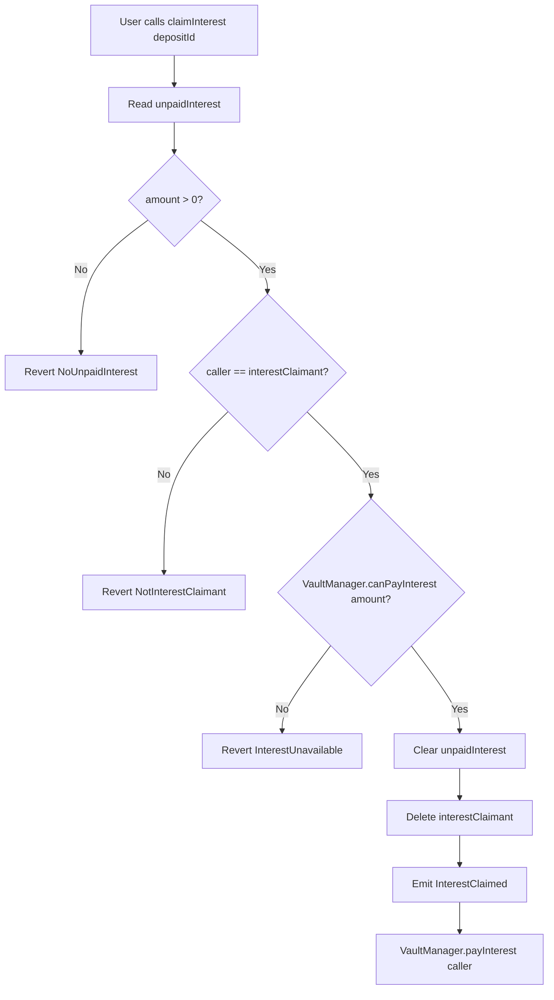

Claim rules:

- Claims are independent and first-come, first-served once the vault is funded.
- Partial claims are not implemented.
- Interest is still paid only by `VaultManager`, never from user principal in `SavingCore`.

## Early Withdrawal

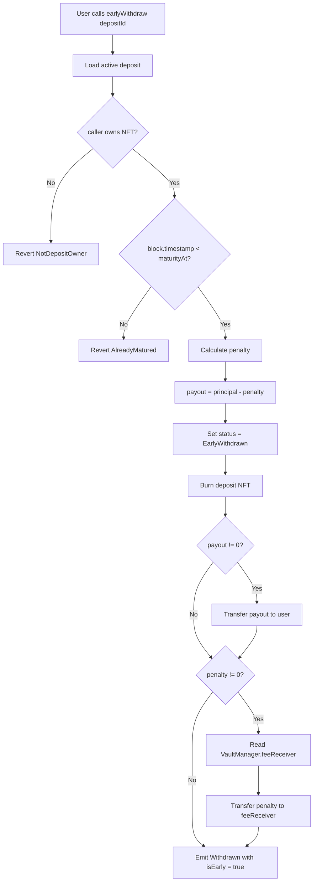

Important behavior:

- No interest is paid for early withdrawal.
- Penalty is calculated from the deposit's snapshotted penalty rate.
- Penalty goes to `VaultManager.feeReceiver()`.
- Early withdrawal is rejected at or after `maturityAt`.

## Manual Renewal

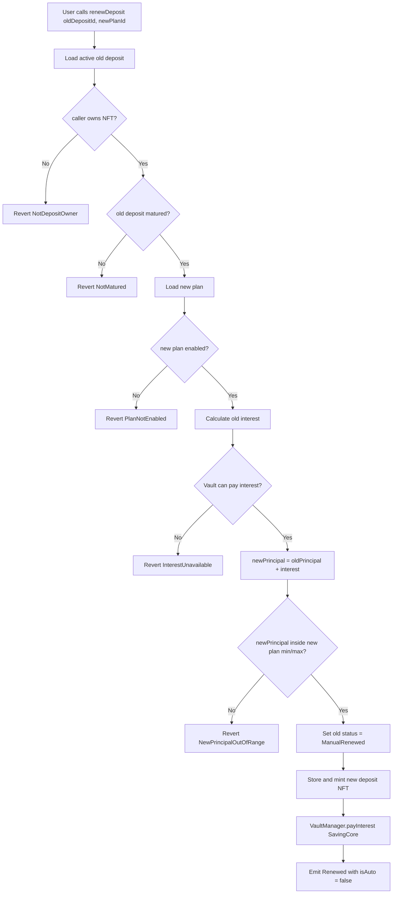

Manual renewal rules:

- Manual renewal compounds interest into the new principal.
- The renewed deposit uses the selected new plan's current APR and penalty.
- If the vault cannot pay the interest, renewal reverts instead of creating a principal-only renewal.

## Auto Renewal

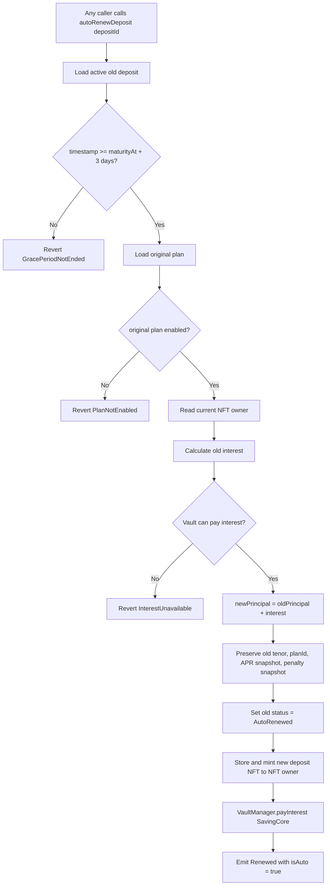

Auto-renew rules:

- Auto-renew is permissionless; any account or bot can call it after the grace period.
- The current grace period is `3 days` for student variant ending `71`.
- Auto-renew preserves the old deposit's APR and penalty snapshots while the original plan remains enabled.
- If the bot is offline, the deposit remains active and the user can still withdraw or manually renew.

## Auto-Renew Bot

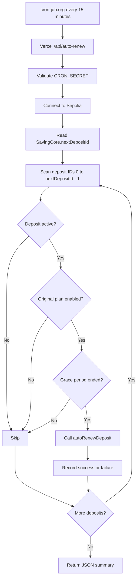

Operational notes:

- The bot wallet pays gas.
- The endpoint supports dry-run mode.
- The contract does not depend on a trusted bot because `autoRenewDeposit` is permissionless.
- `scripts/autoRenewBot.ts` remains available as a local/manual Hardhat fallback.

## Marketplace Listing

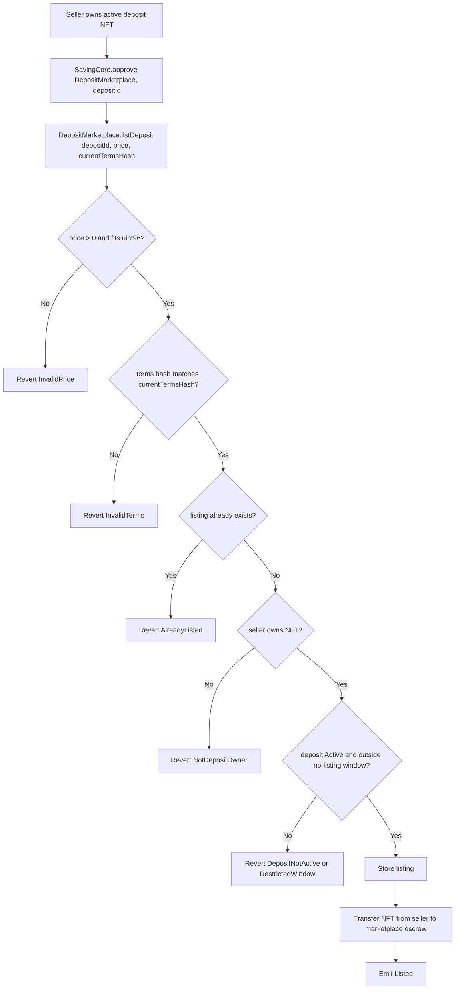

Listing rules:

- Only the current NFT owner can list.
- Only active deposits can be listed.
- Seller must accept the current marketplace terms hash.
- Listing transfers the deposit NFT into marketplace escrow.
- While escrowed, the seller no longer owns the NFT and cannot withdraw or renew it.

## Marketplace Purchase

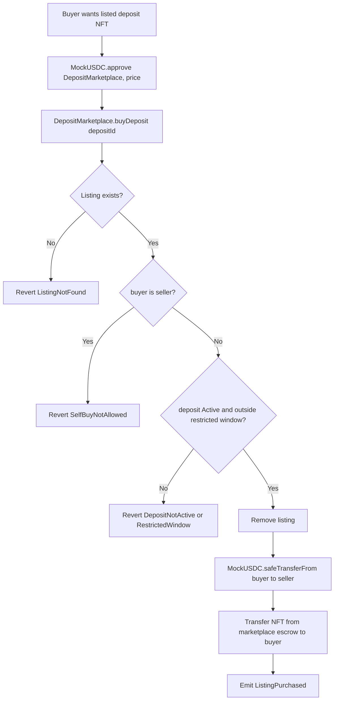

Purchase result:

- Seller receives the listing price in `MockUSDC`.
- Buyer receives the actual `SavingCore` deposit NFT.
- Buyer becomes the deposit owner and controls future withdrawal, renewal, transfer, or sale rights.

## Marketplace Cancel And Cleanup

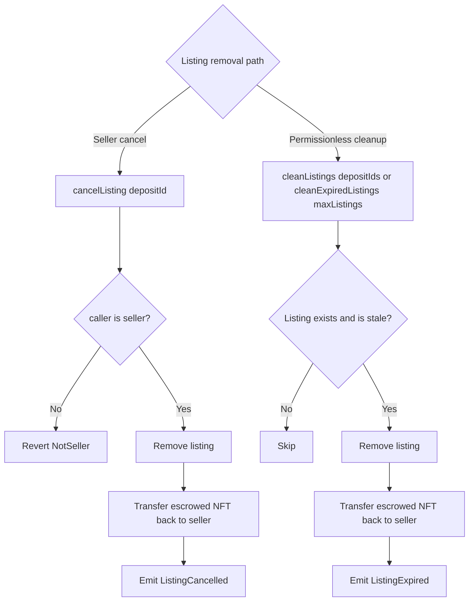

Stale listing conditions:

- Deposit is no longer active.
- Deposit entered the no-listing window.
- Marketplace no longer escrows the NFT.

No-listing window formula:

```text
D = min(max(10, floor(tenorDays * 5 / 100)), 30)
blocked when block.timestamp >= maturityAt - D days
```

For the default `180 days` plan, the restricted window is the final `10 days`.

## Pause And Emergency Controls

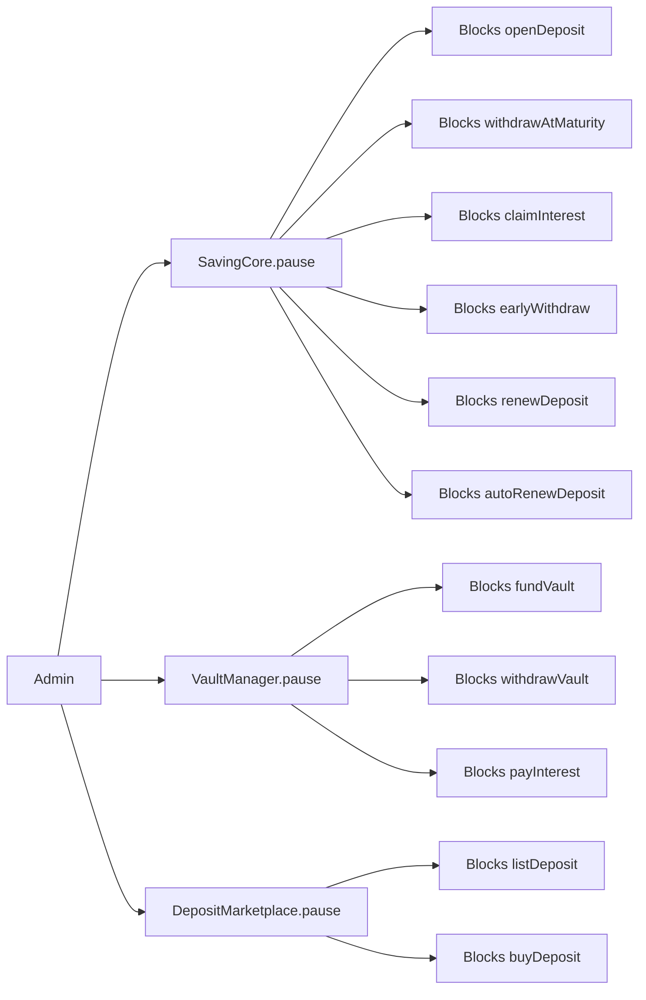

Notes:

- `SavingCore` plan administration remains available while `SavingCore` is paused.
- `DepositMarketplace.cancelListing` is not paused, so sellers can still recover listed NFTs through cancellation.
- Marketplace cleanup functions are permissionless and are not paused.

## Deposit State Lifecycle

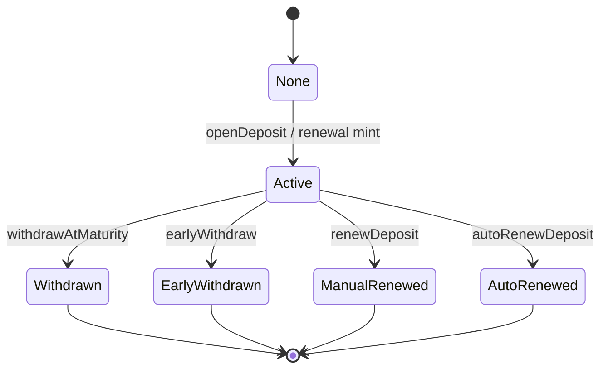

Lifecycle rules:

- Only `Active` deposits can be withdrawn, renewed, listed, or bought.
- Withdrawals and renewals close the old deposit, preventing double withdrawal.
- Marketplace transfers do not change deposit status; they only change ERC721 ownership.
- The current ERC721 owner owns the deposit action rights.

## Approval Matrix

| Use case | Approval target | Approval type | Why |
| --- | --- | --- | --- |
| Open deposit | `SavingCore` | ERC20 `MockUSDC.approve` | `SavingCore.openDeposit` pulls principal with `safeTransferFrom`. |
| Fund vault | `VaultManager` | ERC20 `MockUSDC.approve` | `VaultManager.fundVault` pulls interest liquidity with `safeTransferFrom`. |
| List deposit NFT | `DepositMarketplace` | ERC721 `SavingCore.approve` | Marketplace must transfer the NFT into escrow. |
| Buy listed NFT | `DepositMarketplace` | ERC20 `MockUSDC.approve` | Marketplace pulls payment from buyer and pays seller. |
| Withdraw / renew / claim interest | None | None | Contracts transfer funds out or update state; no token pull from caller is needed. |

## Primary Source Files

| Area | Files |
| --- | --- |
| ERC20 test token | `contracts/MockUSDC.sol` |
| Principal, plans, deposits, renewals | `contracts/SavingCore.sol` |
| Interest vault and fee receiver | `contracts/VaultManager.sol` |
| NFT marketplace escrow | `contracts/DepositMarketplace.sol` |
| Deployment wiring | `deploy/*.ts` |
| Auto-renew operations | `api/auto-renew.ts`, `scripts/autoRenewBot.ts`, `docs/AUTO_RENEW_BOT_SETUP.md` |
| Marketplace cleanup operations | `api/marketplace-cleanup.ts`, `docs/PHASE_16_ESCROW_MARKETPLACE.md` |
| Frontend flows | `frontend/src/pages/UserDashboard.tsx`, `frontend/src/pages/AdminDashboard.tsx`, `frontend/src/pages/Marketplace.tsx` |
